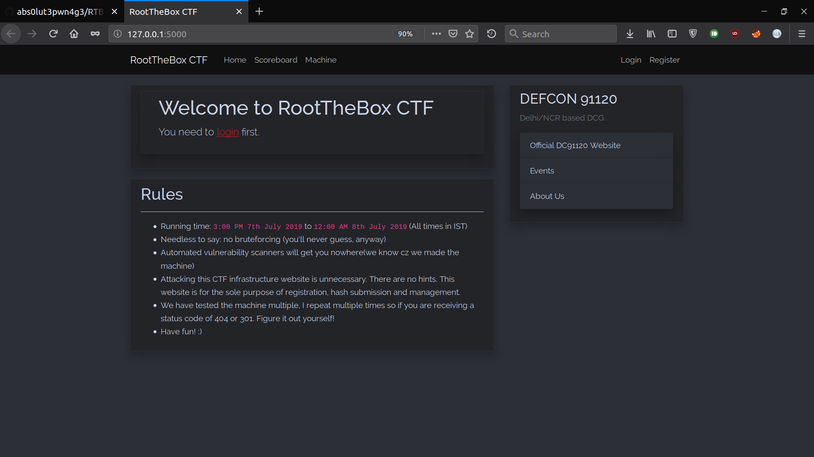
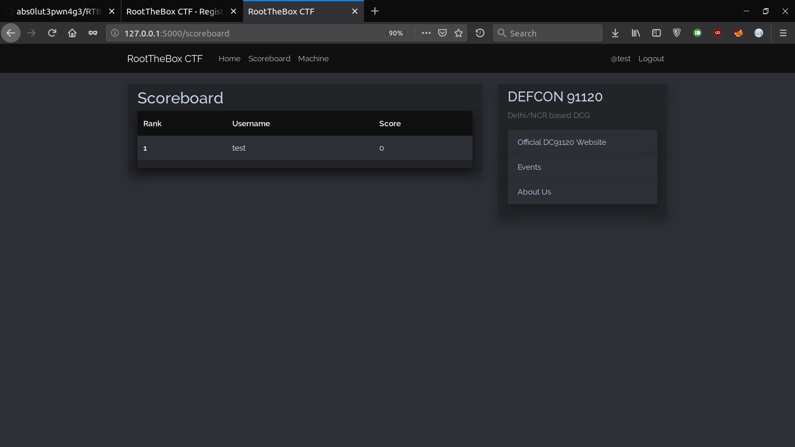
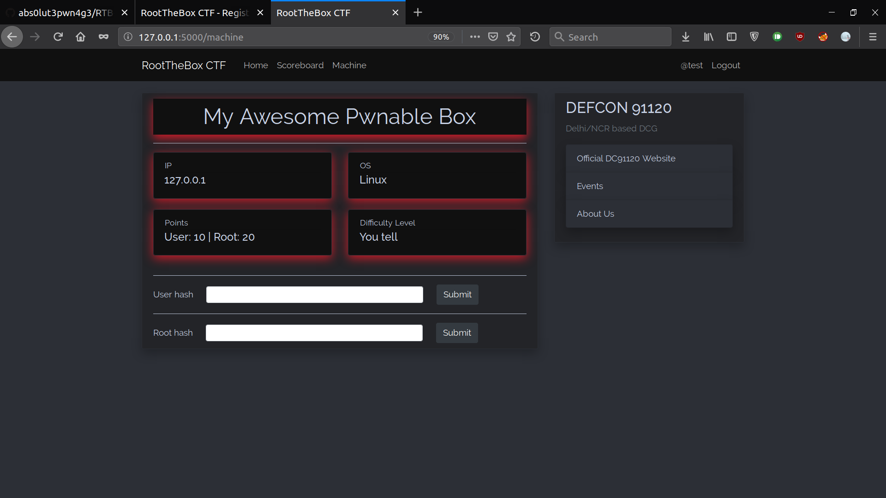

# RootTheBox CTF Framework

A CTF framework(in flask) for HackTheBox style machines. 

## Features

* Flask Blueprints
* Flask-admin for Admin views and easy realtime management
* Easily deployable on Heroku.
* User Registration, account management, Forgot password
* Hash submission (currently 2 hashes: user and root)
* Real time scoreboard tracking
* A page to show relevant details about the machine such as name, IP, OS, points and difficulty level. 

## How To Use

### Requirements

* `Python 3.7.3` or atleast `> 3.6`.
* Packages: [`src/requirements.txt`](src/requirements.txt).

### Installation

1. Git clone the repo and `cd ` into it

```bash
$ git clone https://github.com/abs0lut3pwn4g3/RTB-CTF-Framework
$ cd RTB-CTF-Framework/
```
2. Create `virtual environment` to deal with dependencies and requirements.

```bash
$ virtualenv -p /usr/bin/python3 venv
$ source venv/bin/activate
$ cd src/
```

3. With `virtual environment` activated, install requirements, init db and run !

```bash
[venv]$ pip install -r requirements.txt 
[venv]$ python create_db.py # Only required on first run
[venv]$ python run.py
```

### For Your CTF

Using this as simple as anything. Just configure your CTF settings in [`config.py`](https://github.com/abs0lut3pwn4g3/RTB-CTF-Framework/blob/master/src/FlaskRTBCTF/config.py).

> Note: DO NOT FORGET to change admin credentials from [create_db.py](https://github.com/abs0lut3pwn4g3/RTB-CTF-Framework/blob/master/src/create_db.py)

#### Creating database instance file

Locally or for docker/linux server,

```bash
$ source venv/bin/activate
$ python src/create_db.py
```

> Running this also creates an admin account by default,

For Heroku, 

```bash
$ heroku run python
>>> from FlaskRTBCTF import db, create_app
>>> db.create_all(app=create_app())
```

## To-do

- [ ] db relationship between User and Score Tables
- [ ] Support for more hashes
- [ ] Testing Password reset functionality
- [ ] More info for `home.html`
- [ ] Need to implement `account.html` (not a priority)

<hr/>

- [x] isAdmin column in User table and Admin views (priority)
- [x] Notifications
- [x] Use Flask Blueprinsts
- [x] Finalize black theme?
- [x] Error messages not appearing in `/submit`
- [x] Implement `machine.html` to server a page where one can download/serve machines
- [x] Add basic info and stuff to `layout.html`
- [x] User is able to submit hash multiple times and keep increasing score, so need to implement limitations


## Screenshots




